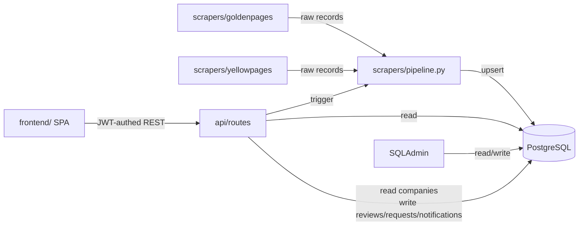
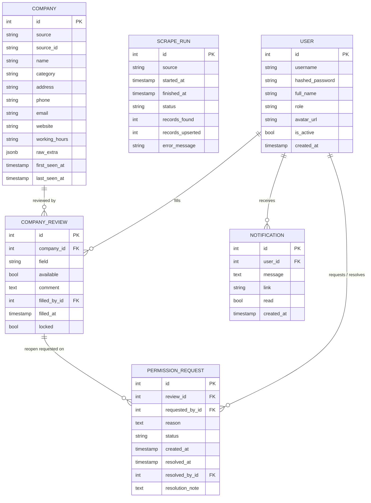
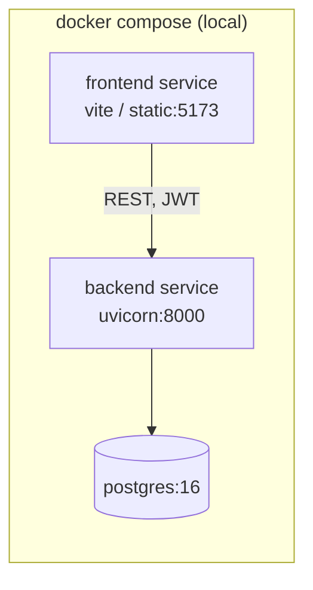

# Architecture Spine — parsing-project-backend

## Design Paradigm

Layered application (`api` → `service/pipeline` → `models`/DB) with an **adapter pattern** for ingestion: each external source (goldenpages.uz, yellowpages.uz) implements a common `SourceAdapter` interface that yields raw records; a single pipeline normalizes and persists them. Admin (SQLAdmin) reads/writes the same models directly, in parallel to the API layer.

The operator/admin review workflow added 2026-07-28 is a second, independent domain in the same layered app — its own models, its own `api/routes/*`, consumed by a separate `frontend/` SPA instead of SQLAdmin. It reads `companies` but never writes it; scraping and review are one-directional (scrape → review), never the reverse.



## Invariants & Rules

### AD-1 — Backend stack

- **Binds:** all
- **Prevents:** mixing Django and FastAPI, or splitting scraping/API/admin across different runtimes
- **Rule:** the whole backend is one FastAPI application using SQLAlchemy 2.x (async) as ORM and SQLAdmin for the admin UI. `[ADOPTED]` — user chose this explicitly over Django+Jazzmin.

### AD-2 — One shared `companies` table, source-tagged, no auto-merge

- **Binds:** data model, every source adapter
- **Prevents:** each adapter inventing its own table shape, or silently merging same-looking companies from different sources into one row
- **Rule:** every adapter writes into the single `companies` table with `source` + `source_id` columns and a unique constraint on `(source, source_id)`. Cross-source deduplication is out of scope for this phase — `[ADOPTED]`, `[ASSUMPTION]` it can be added later as a separate batch process without changing this table's shape.

### AD-3 — Idempotent, re-runnable ingestion; known companies are skipped, not refreshed

- **Binds:** `scrapers/pipeline.py`, every adapter
- **Prevents:** duplicate rows, broken state on re-run, and re-fetching (network + time cost) a company already in the DB for that source
- **Rule:** before a run starts, the pipeline loads the set of `source_id`s already stored for that `source` and passes it to the adapter as `skip_ids`; every adapter must skip those at discovery time (never issue the detail-page fetch for a known id), not just dedupe after the fact. A `source_id` not in that set is inserted via the pipeline's upsert call. `[ADOPTED]` (amended 2026-07-28 — user chose skip-known over refresh-known; original behavior upserted/refreshed every sighting). Consequence: an existing company's fields never change on a normal run; catching real-world updates needs a deliberate re-scrape (clear/target those rows) or a future forced-refresh mode -- neither exists yet.

### AD-4 — Adapter boundary

- **Binds:** `backend/app/scrapers/*`
- **Prevents:** a new/changed adapter bypassing normalization, or the API/admin layers reaching into a specific adapter's internals
- **Rule:** an adapter's only public surface is `fetch_raw() -> Iterable[RawRecord]` and `normalize(raw) -> CompanyIn` (shape fixed by `backend/app/scrapers/base.py`). `api/` and `admin/` never import a concrete adapter module — they only call `scrapers/pipeline.py`, which looks adapters up by `source` name. Each adapter owns its own fetch mechanism internally (plain HTTP client vs headless browser) — that choice is not a spine-level decision.

### AD-5 — Persistence target

- **Binds:** persistence layer, deployment
- **Prevents:** a SQLite dev path silently diverging in behavior (types, concurrency) from how the app actually runs
- **Rule:** PostgreSQL only, via SQLAlchemy 2.x async engine + Alembic migrations. `[ADOPTED]`.

### AD-6 — Repo layout

- **Binds:** whole repo
- **Prevents:** premature multi-service split
- **Rule:** all backend code lives under one top-level `backend/` folder. `[ADOPTED]` — explicit user instruction. Amended 2026-07-28: the new operator-facing SPA lives under a sibling top-level `frontend/` folder (per explicit user instruction) — still one repo, two top-level app folders, no further split.

### AD-7 — Auth: JWT, two roles, hashed passwords

- **Binds:** `api/routes/auth.py`, every operator/admin-facing route
- **Prevents:** ad-hoc session schemes per route, plaintext/reversible password storage, an operator reaching admin-only endpoints by guessing a URL
- **Rule:** a single `users` table holds both operators and admins, distinguished by a `role` column (`operator` | `admin`) — not separate tables, and it is the **one identity source for the whole backend**: OperatorDesk (`POST /api/auth/login`) issues a JWT (HS256, `SECRET_KEY`-signed, `role` + `user_id` claims, `[ASSUMPTION]` 12h expiry, no refresh token in v1) against it, and SQLAdmin's own login (`AdminAuth` in `admin/setup.py`) checks the *same table* (`role == "admin"`) instead of a hardcoded credential pair — amended 2026-07-29, user explicitly wanted one admin account usable in both places. There is no separate `ADMIN_USERNAME`/`ADMIN_PASSWORD` config anymore; the bootstrap admin (`INITIAL_ADMIN_USERNAME`/`PASSWORD`, created once on first startup if `users` is empty) is that one account. Every non-login API route requires a valid JWT via a shared FastAPI dependency; admin-only routes additionally check `role == "admin"` and 403 otherwise. Passwords hashed with `bcrypt` directly — never stored or logged in plaintext. `[ADOPTED]`. SQLAdmin still uses its own session-cookie mechanism (not JWT) to authenticate the request, but the credential it checks against is the same `users` row.

### AD-8 — Review/lock model: one row per (company, field), lock is a team-wide gate

- **Binds:** data model, `api/routes/reviews.py`
- **Prevents:** two operators overwriting each other's finding, a field silently becoming editable again without a tracked reason, review logic leaking into the scraping domain (AD-2/AD-3)
- **Rule:** a `company_reviews` table holds one row per `(company_id, field)` where `field ∈ {website, lms}` — independent lock state per field, never a pair of columns bolted onto `companies`. A row starts absent (unfilled); `POST /api/reviews/{company_id}` creates *both* field-rows in one transaction (available: bool, comment: text, filled_by, filled_at) and sets `locked = true` on both — the UI submits them together (EXPERIENCE.md), the API enforces it atomically. A locked row is not writable by any route except the reopen path below. Once unlocked (below), **any** operator may submit the next fill, not only the original filler — `locked` is a team-wide gate, not a per-user permission. `[ADOPTED]`, `[ASSUMPTION]` re: any-operator-can-refill once reopened (simpler than tracking "reserved for requester").
- Reopen path: a `permission_requests` row (`review_id`, `requested_by`, `reason`, `status: pending|approved|denied`) is created by the request-permission action; approving it is the *only* way `company_reviews.locked` flips back to `false`. No direct "unlock" endpoint exists outside this flow.

### AD-9 — Notifications: DB is the record, WebSocket is the delivery shortcut

- **Binds:** `api/routes/notifications.py`, `api/routes/ws.py`, `services/notifications.py`, `services/ws_manager.py`, frontend `notification-bell.tsx`
- **Prevents:** a second source of truth for notification state (the socket never carries anything the DB doesn't also have); reintroducing a polling loop once a live channel exists
- **Rule:** a `notifications` table (`user_id`, `message`, `link`, `read`, `created_at`) is written synchronously by the same request that causes it (permission requested → notify admins; approved/denied → notify requester, message includes the admin's `resolution_note` when given). `services/notifications.notify()` flushes the row (assigning its id) and then pushes the same payload over that user's open WebSocket connection(s), if any, via an in-memory `ConnectionManager` (`services/ws_manager.py`). `GET /api/ws/notifications?token=<JWT>` is the single connection per session — the browser WebSocket API can't set an Authorization header, so the access token travels as a query param instead, validated the same way as the REST JWT. `[ADOPTED]` (amended 2026-07-29 — user explicitly wanted live delivery over the original polling design). `[ASSUMPTION]`: `ConnectionManager` is per-process in-memory, correct only because this backend runs a single uvicorn worker/container; a multi-worker or multi-replica deployment would need a shared broker (e.g. Redis pub/sub) instead — noted in Deferred. The REST `GET /api/notifications` endpoint is unchanged and still authoritative for cold load / reconnect; the socket only delivers new events while open.
- **Link taxonomy (amended 2026-08-13):** `link` is one of three prefixes, each consumed differently per role by `notification-bell.tsx`'s `resolveLink(link, role)` — `review:{company_id}:{field}` → `/review/{id}` (operator, always); `permission-request:{id}` → `/admin/permission-requests` (admin) or `/my-requests` (operator); `claim-request:{id}` → `/admin/claim-requests` (admin) or `/my-requests` (operator). The `claim-request:` case and the operator branch of `permission-request:` were missing entirely until this pass (clicking did nothing) — caught by testing an actual notification click end-to-end, not just confirming the WebSocket frame arrived.
- **Operator-facing request history (added 2026-08-13):** operators previously had no way to see the status of requests they'd sent — `GET /permission-requests` and `GET /claim-requests` were `require_admin`-gated. Both now take `get_current_user` instead and self-filter to `requested_by_id`/`operator_id == user.id` when the caller isn't an admin (admins still see everyone's, unchanged). Frontend: `routes/operator/my-requests.tsx` ("Mening so'rovlarim", new nav entry in `OPERATOR_NAV`) reuses these same endpoints read-only — a type Tabs (permission/claim) over a status Tabs (pending/approved/denied), no approve/deny actions.

### AD-10 — Frontend stack

- **Binds:** `frontend/`
- **Prevents:** the frontend reinventing auth/session handling per screen, or drifting from the OperatorDesk UX spine's shadcn/ui foundation
- **Rule:** React + TypeScript + Vite (SPA, no SSR — there's no public/SEO surface, just an internal tool behind login) + Tailwind CSS + shadcn/ui, per `EXPERIENCE.md`/`DESIGN.md` (`_bmad-output/planning-artifacts/ux-designs/ux-parsing-project-2026-07-28/`). JWT stored in memory + `localStorage` for session persistence across reloads (`[ASSUMPTION]` accepted XSS-token-theft trade-off for v1 simplicity over httpOnly-cookie complexity, given this is an internal tool, not a public product). One Vite app, role-gated client-side routing (not two separate builds) — matches AD-7's single `users`/`role` model.
- **Deployment (amended 2026-08-13):** the frontend's `api.ts` defaults `API_BASE` to the *relative* path `/api` (not an absolute `http://host:port/api`), so the built static bundle works behind any domain/IP without a rebuild. `frontend/nginx.conf` reverse-proxies `/api/`, `/static/`, and `/admin/` to the `backend` service (same docker-compose network) so the browser only ever talks to one origin — the frontend's own. `Host $http_host` (not `$host`) is required on every `proxy_set_header` here, since `$host` silently drops a non-standard port and breaks any absolute-URL redirect the backend issues (e.g. SQLAdmin's trailing-slash redirect). An explicit `VITE_API_URL` build arg still overrides this (for the rare case for frontend/backend on genuinely different origins) — the Dockerfile writes it to `.env.production` only when the arg is non-empty, since an unconditional `ENV VITE_API_URL=""` would bake in an empty *string* (not `undefined`) and silently defeat the `?? "/api"` fallback. `frontend/.env` (real, gitignored, used only for local `npm run dev` against the dockerized backend on `:8001`) is excluded from the Docker build context via `.dockerignore` for the same reason — Vite loads bare `.env` unconditionally, so leaving it in the image would re-introduce the hardcoded-localhost bug it was built to remove. `[ADOPTED]`.
- **TLS (added 2026-08-13, superseded same day):** originally planned as Docker owning `:80`/`:443` directly (two nginx configs, `nginx.conf` active / `nginx.https.conf` on the shelf, swap when a cert is in hand). Superseded once the user set up a host-level nginx on the real server instead (likely for `certbot --nginx`'s auto-detection, which needs a real nginx site file on the host filesystem — a Docker-internal nginx.conf isn't visible to it). **Current topology:** `docker-compose.yml`'s `frontend` service now binds `127.0.0.1:8080:80` (localhost-only, not public) instead of `80:80` — host nginx is the sole public listener on `:80`/`:443` and reverse-proxies *everything* (`location /`) to `http://127.0.0.1:8080`, letting the frontend container's own nginx (AD-10's `/api`, `/static`, `/sqladmin` routing) do the rest unchanged, one layer in. `[ADOPTED]`. **Bug caught this way:** the user's first host-nginx attempt duplicated the frontend container's `/api`/`/static`/`/sqladmin` proxy blocks at the host level, pointed at `proxy_pass http://backend:8000` — `backend` is a docker-compose service-name hostname, resolvable only *inside* that network, never on the host's own network stack. Symptom was `/api/ws/notifications` 404s (a plain HTTP request reaching the FastAPI app instead of a real WS upgrade — something in front silently dropped the `Upgrade` header) while regular HTTP routes seemed to work; root-caused via the backend's own access log showing the raw client IP arriving directly, meaning something between nginx and the app wasn't forwarding the upgrade handshake correctly. Passthrough-everything avoids the whole class of problem — one proxy hop's `Upgrade`/`Connection` headers to get right (host nginx's own), not two independently-maintained sets across two different nginx configs.
- **Local dev impact:** the app now serves on `http://localhost:8080` on a machine without a host nginx in front (this dev machine), not `:80` — direct-port-80 access intentionally stopped working the moment the frontend service moved to a localhost-only non-standard port, since a real deploy needs `:80`/`:443` free for host nginx.
- **SQLAdmin path collision (found and fixed 2026-08-13):** SQLAdmin defaults to mounting itself at `/admin` — the same prefix the frontend's own React routes already used for the whole admin section (`/admin`, `/admin/operators`, `/admin/permission-requests`, `/admin/claim-requests`). nginx's single-origin proxy can only route a given path prefix to one place, so once traffic actually hit the server for those URLs directly (not just arrived at via in-app client-side navigation, which never issues a fresh HTTP request and so never exercised nginx's routing), every one of them 404'd. `backend/app/admin/setup.py` now passes `base_url="/sqladmin"` to sqladmin's `Admin(...)`, and both nginx configs proxy `/sqladmin` instead of `/admin`. `[ADOPTED]`. Caught by testing an actual full-page navigation (`page.goto` in Playwright, equivalent to a URL bar entry or refresh) to `/admin/permission-requests`, not just client-side `<Link>` transitions from an already-loaded SPA — a useful reminder that the two exercise completely different code paths once a reverse proxy is in the picture.

### AD-11 — Claims: one active claim per operator, deadline escalation via admin-gated requests

- **Binds:** data model, `services/claims.py`, `api/routes/claims.py`, `api/routes/claim_requests.py`, `api/routes/reviews.py` (queue filtering, completion hook), frontend `queue.tsx`, `claim-banner.tsx`, `defer-dialog.tsx`, `admin/claim-requests.tsx`
- **Prevents:** two operators working the same company at once, an operator silently accumulating unlimited unfinished work with no visibility to admin, a claim vanishing into limbo with no path back to the pool
- **Rule:** a `company_claims` table (`company_id`, `operator_id`, `claimed_at`, `status ∈ {active, deferred, completed, released}`, `deadline_at`, `deadline_days`) tracks one row per claim attempt. `POST /api/claims/{company_id}/claim` requires the operator have no other `active` claim (409 `active_claim_exists` otherwise) and no `overdue` `deferred` claim (409 `overdue` — the block described below); it also requires the company not already be claimed by anyone (`active`/`deferred` status excludes it from `GET /api/reviews`'s unfilled listing for *every* operator, not just the claimant — 409 `already_claimed` on the race). To move off an unfinished `active` claim onto a new company, `POST /api/claims/{id}/defer` is called with `days` + optional `reason`: `days <= 2` auto-approves (claim flips to `deferred` with `deadline_at = now() + days`, caller may immediately retry the claim on the new company); `days >= 3` instead creates a pending `claim_requests` row (`action=extend`) and the operator stays blocked from claiming until an admin resolves it. A `deferred` claim past its `deadline_at` is "overdue" (`is_overdue()`, computed not stored) and **blocks all new claims** for that operator — the 409 response echoes the operator's own stated `deadline_days` back to them (frontend renders it as a direct quote) alongside two ways out, both admin-gated `claim_requests` rows: `action=extend` (push `deadline_at` further out) or `action=release` (reason required) — approving a release flips the claim to `released`, which drops it out of the exclusion filter so it reappears in the general pool for any operator. Completing a company's review (both `website`/`lms` fields locked, per AD-8) auto-completes that operator's claim on it (`complete_claims_for`) — no manual "close claim" step. `[ADOPTED]` (2026-07-29). `[ASSUMPTION]`: no cap on how many non-overdue `deferred` claims one operator can accumulate — only the overdue state blocks; revisit if operators start deferring indefinitely without finishing anything (see Deferred).

### AD-12 — Category filter: split raw `category` text at query time, no taxonomy table

- **Binds:** `api/routes/reviews.py` (`GET /reviews/categories`, `category` param on `GET /reviews` and `GET /reviews/count`), frontend `queue.tsx`
- **Prevents:** a `categories` table / many-to-many join being introduced just to support one dropdown filter, ahead of the cross-source taxonomy work already pushed to Deferred (AD-2's note)
- **Rule:** `companies.category` stays a single semicolon-separated raw string per AD-2's Deferred taxonomy note (goldenpages scrapes it that way; the literal separator is `"; "`). `GET /api/reviews/categories` reads every non-null `category`, splits each on `"; "`, and returns the deduplicated, sorted set of individual tags — computed per-request (no cache, no denormalized table; ~250 companies makes this trivial). Filtering by one tag uses Postgres' `string_to_array(category, '; ')` compared via `ANY(...)`, an exact-match-within-the-list-of-tags check, not a substring `ILIKE` (which would wrongly match e.g. `"Институты (вузы) Карши"` against a filter for `"Институты (вузы) Нукуса"` sharing the `"Институты (вузы)"` prefix). The operator picks exactly one tag at a time (not multi-select) — an `[ASSUMPTION]` matching EXPERIENCE.md's single-`Select` queue-filter pattern (same shape as the existing `status`/`q` filters). `[ADOPTED]` (2026-08-13).

## Consistency Conventions

| Concern | Convention |
| --- | --- |
| Naming (entities, files, interfaces, events) | snake_case for DB columns/files, PascalCase for Python classes; adapter modules named `backend/app/scrapers/{source}/adapter.py`, `source` values are the literal strings `goldenpages` / `yellowpages` |
| Data & formats (ids, dates, error shapes) | primary keys are DB-generated integers; all timestamps UTC `datetime`; a company's *raw* site fields that don't map cleanly to a column go into `raw_extra` (JSONB) instead of growing new columns ad hoc |
| State & cross-cutting (mutation, errors, logging, config, auth) | only `scrapers/pipeline.py` writes `companies`/`scrape_runs`; only `api/routes/reviews.py` writes `company_reviews`; only `permission_requests.py` resolves `permission_requests` and flips a review's `locked` flag; any route that creates a notification-worthy event writes to `notifications` inline (no separate notifier service); config via env vars loaded once in `core/config.py` (pydantic-settings), never read directly with `os.environ` elsewhere; every scrape run is wrapped in one `ScrapeRun` row (status, counts, error) for observability |

## Stack

| Name | Version |
| --- | --- |
| Python | 3.12 |
| FastAPI | 0.140.0 |
| SQLAlchemy | 2.0.51 |
| SQLAdmin | 0.29.0 |
| Alembic | 1.18.5 |
| Pydantic | 2.13.4 |
| Uvicorn | 0.51.0 |
| asyncpg | 0.31.0 |
| httpx | 0.28.1 |
| BeautifulSoup4 | 4.15.0 |
| lxml | 6.1.1 |
| Playwright | 1.61.0 |
| PostgreSQL | 16 |
| bcrypt | 5.0.0 |
| PyJWT | 2.13.0 |
| React | 19.2.8 |
| react-dom | 19.2.8 |
| Vite | 8.1.5 |
| TypeScript | 7.0.2 |
| Tailwind CSS | 4.3.3 |
| react-router-dom | 7.18.2 |
| axios | 1.18.1 |
| shadcn/ui | via `shadcn` CLI (component source copied into repo, not a versioned runtime dep) |

httpx + BeautifulSoup4/lxml cover goldenpages.uz (confirmed classic server-rendered HTML). Playwright is available for yellowpages.uz (confirmed Nuxt 3 app with some client-fetched sections) — its adapter decides at implementation time whether plain HTTP suffices or headless rendering is needed; either way it stays behind the AD-4 adapter boundary.

`bcrypt`/`PyJWT` chosen directly (not `passlib`) — verified 2026-07-28 that passlib is unmaintained (last release 2020, breaks under newer Python) despite older FastAPI docs still referencing it. All frontend versions verified against the npm registry the same day.

## Structural Seed

```text
ParsingProject/
  backend/
    app/
      main.py              # FastAPI app factory, mounts api routers + SQLAdmin
      core/
        config.py           # env-based settings (DB url, JWT secret, etc.)
        db.py                # async engine + session factory
        security.py           # password hash (bcrypt) + JWT encode/decode
        deps.py                # get_current_user / require_admin FastAPI dependencies
      models/
        company.py           # Company ORM model
        scrape_run.py         # ScrapeRun ORM model
        user.py                # User (operator | admin), role column
        review.py               # CompanyReview -- one row per (company_id, field)
        permission_request.py    # PermissionRequest -- reopen lifecycle
        notification.py           # Notification -- per-user, read flag
      schemas/
        company.py            # Pydantic read/write schemas
        auth.py                 # login/token/user schemas
        review.py                 # review fill/read schemas
      scrapers/
        base.py                # SourceAdapter protocol, RawRecord/CompanyIn types
        pipeline.py             # run_adapter(source) -> upserts + writes ScrapeRun
        goldenpages/
          adapter.py
        yellowpages/
          adapter.py
      api/
        routes/
          companies.py          # GET /companies, GET /companies/{id}
          scrapes.py             # POST /scrapes/{source} — trigger a run
          auth.py                 # POST /auth/login, GET/PATCH /auth/me (+ avatar)
          reviews.py               # GET /reviews/queue, GET/POST /reviews/{company_id}, request-permission
          permission_requests.py    # GET, POST .../approve, POST .../deny (admin)
          notifications.py          # GET, POST .../read
          operators.py               # POST/GET /operators (admin), stats
      admin/
        setup.py                # SQLAdmin ModelView registrations
      static/
        avatars/                # uploaded operator avatar files, served via StaticFiles
    alembic/
      versions/
    tests/
    pyproject.toml
    Dockerfile
    .env.example
  frontend/
    src/
      main.tsx
      lib/
        api.ts                 # axios instance, JWT attach/refresh-on-401
        auth-context.tsx         # current user + role, login/logout
      routes/
        login.tsx
        operator/
          queue.tsx
          company-review.tsx
          profile.tsx
        admin/
          dashboard.tsx
          operators.tsx
          permission-requests.tsx
      components/
        ui/                    # shadcn-generated components
        status-badge.tsx
        notification-bell.tsx
    index.html
    vite.config.ts
    tailwind.config.ts
    package.json
    Dockerfile
  docker-compose.yml            # backend + postgres + frontend services
```

### Core data shape (ERD)



`companies.(source, source_id)` is unique. `scrape_runs` has no FK to `companies` — it's a run-level audit log, not a per-record link (per-record provenance already lives on `companies` via `source`/`source_id`/`last_seen_at`).

`company_reviews.(company_id, field)` is unique — `field` is a 2-value string enum (`website`, `lms`), see AD-8. `permission_requests.review_id` has no uniqueness constraint beyond "one *pending* request per review" (enforced in the route, not the schema — a review can accumulate a history of resolved requests over time). `notifications` has no FK to what caused it beyond the free-text `link` field (`[ASSUMPTION]`: a string the frontend parses to deep-link, e.g. `review:{company_id}:{field}` or `permission-request:{id}` — not a polymorphic FK, simplest thing that works for two link shapes).

### Deployment & environments

Local Docker Compose running three services — `backend` (`uvicorn`), `frontend` (built static assets served by a lightweight web server / dev server), and `postgres`. No staging/production hosting or CI/CD is decided yet — see Deferred.



## Deferred

- **Cross-source deduplication/merge** (matching the same real-world company across goldenpages and yellowpages into one canonical record) — pushed past this phase; revisit once both adapters are producing data and duplicates can be inspected for real.
- **Category taxonomy normalization** — the two sites likely use different category trees; stored as raw text on `Company` for now instead of a shared `categories` table.
- **Scheduling** (cron/periodic re-scrape) — the pipeline is built idempotent (AD-3) specifically so this can be bolted on later (e.g. APScheduler, or an external cron calling `POST /scrapes/{source}`) without a redesign.
- **Rate limiting / politeness / robots.txt handling per adapter** — left to each adapter's implementation, not fixed here as a spine invariant.
- **JWT refresh tokens / logout-everywhere / token revocation list** — v1 is a single long-lived access token (AD-7); revisit if session-hijack risk or forced-logout needs become real.
- **Avatar storage backend** — local disk under `backend/app/static/avatars/` for v1 (AD-10 area); revisit if deployment moves beyond a single machine (would need object storage, e.g. S3/MinIO, so uploads survive a container rebuild).
- **Multi-worker/multi-replica notification delivery** — AD-9's `ConnectionManager` is in-process memory; scaling the backend beyond one worker would drop a user's push if their socket lands on a different process. Needs a shared broker (Redis pub/sub or similar) if that becomes real. `GET /api/notifications` still works regardless (unaffected fallback).
- **Permission-request resolution note is one-way** — admin's note travels to the requester via the approval/denial notification message (AD-8/AD-9); it isn't a threaded conversation. Revisit if back-and-forth on a single request becomes a real need.
- **"Any operator can refill after reopen" vs. reserved-for-requester** — AD-8's simplifying choice; revisit if abuse/confusion surfaces in practice.
- **SQLAdmin vs. OperatorDesk session mechanism unification** — identity is now shared (AD-7, amended), but SQLAdmin still uses its own session-cookie login screen rather than accepting the OperatorDesk JWT directly; revisit only if maintaining two login *screens* (not two identities) becomes real overhead.
- **Staging/production hosting, CI/CD** — only local Docker Compose is decided; where/how this deploys beyond a developer machine is open. What *is* now decided (2026-08-13): a fresh `docker compose up` on any machine — no `.env` files present, since both `backend/.env` and `frontend/.env` are gitignored — boots correctly and is immediately usable: `backend/.env`'s `env_file` directive is `required: false` (was a hard failure before), every `Settings` field has a working code-level default (`database_url` defaults to the docker-compose network hostname `postgres`, not `localhost`), the bootstrap admin defaults to `admin`/`admin123` when `users` is empty, and the frontend talks to the backend via nginx same-origin reverse-proxying (AD-10) rather than a baked-in host:port. Verified end-to-end in an isolated sandbox (fresh postgres + freshly-built images, zero env vars). TLS, a real domain, and CI/CD remain undecided.
- **No cap on accumulated deferred claims** (AD-11) — an operator can defer onto company after company (each ≤2 days, auto-approved) without finishing any of them, as long as none goes overdue yet; only overdue status blocks. Revisit with a max-open-deferred-claims limit if this becomes a real gaming-the-system pattern.
- **Deactivated operator with an open claim** (AD-11) — if admin deactivates a `User` (`is_active=false`) while they hold an `active`/`deferred` `company_claims` row, nothing currently releases that claim automatically; the company stays excluded from the pool indefinitely. Revisit if operator deactivation becomes a real workflow (e.g. auto-release their open claims on deactivation).
