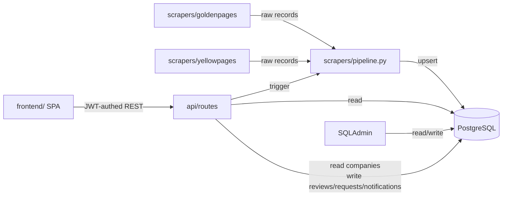
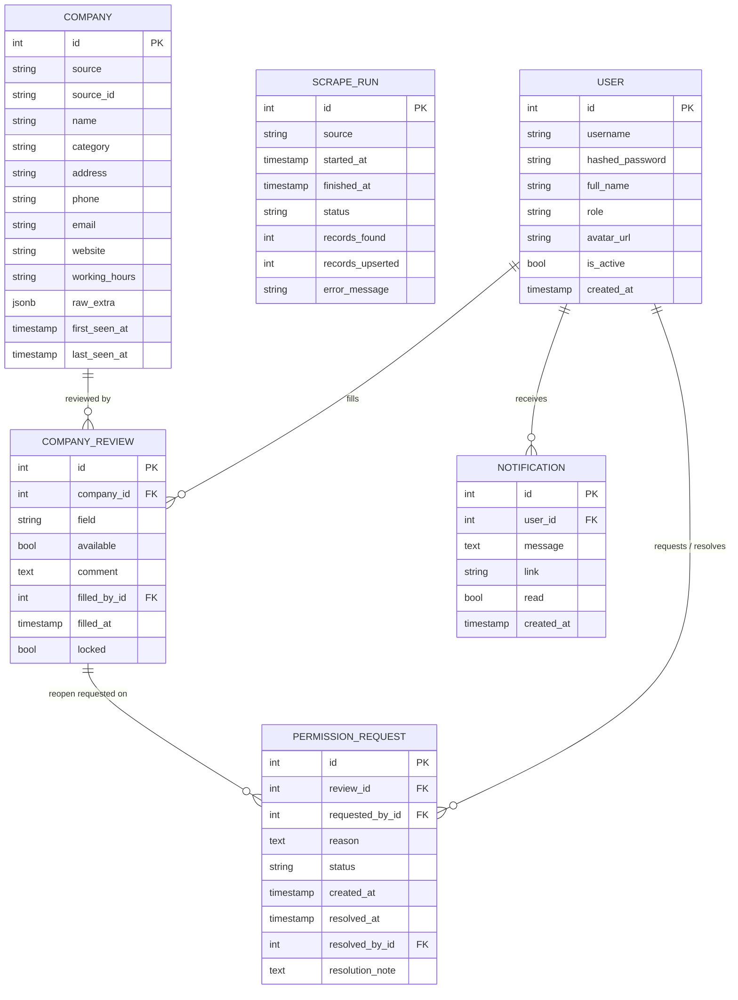
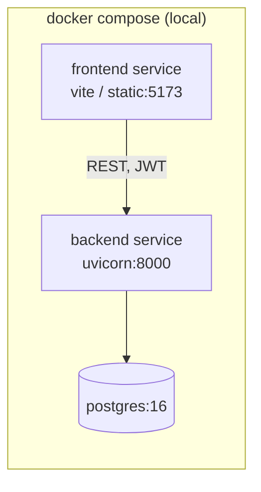

# Architecture Spine — parsing-project-backend

## Design Paradigm

Layered application (`api` → `service/pipeline` → `models`/DB) with an **adapter pattern** for ingestion: each external source (goldenpages.uz, yellowpages.uz) implements a common `SourceAdapter` interface that yields raw records; a single pipeline normalizes and persists them. Admin (SQLAdmin) reads/writes the same models directly, in parallel to the API layer.

The operator/admin review workflow added 2026-07-28 is a second, independent domain in the same layered app — its own models, its own `api/routes/*`, consumed by a separate `frontend/` SPA instead of SQLAdmin. It reads `companies` but never writes it; scraping and review are one-directional (scrape → review), never the reverse.



## Invariants & Rules

### AD-1 — Backend stack

- **Binds:** all
- **Prevents:** mixing Django and FastAPI, or splitting scraping/API/admin across different runtimes
- **Rule:** the whole backend is one FastAPI application using SQLAlchemy 2.x (async) as ORM and SQLAdmin for the admin UI. `[ADOPTED]` — user chose this explicitly over Django+Jazzmin.

### AD-2 — One shared `companies` table, source-tagged, no auto-merge

- **Binds:** data model, every source adapter
- **Prevents:** each adapter inventing its own table shape, or silently merging same-looking companies from different sources into one row
- **Rule:** every adapter writes into the single `companies` table with `source` + `source_id` columns and a unique constraint on `(source, source_id)`. Cross-source deduplication is out of scope for this phase — `[ADOPTED]`, `[ASSUMPTION]` it can be added later as a separate batch process without changing this table's shape.

### AD-3 — Idempotent, re-runnable ingestion; known companies are skipped, not refreshed

- **Binds:** `scrapers/pipeline.py`, every adapter
- **Prevents:** duplicate rows, broken state on re-run, and re-fetching (network + time cost) a company already in the DB for that source
- **Rule:** before a run starts, the pipeline loads the set of `source_id`s already stored for that `source` and passes it to the adapter as `skip_ids`; every adapter must skip those at discovery time (never issue the detail-page fetch for a known id), not just dedupe after the fact. A `source_id` not in that set is inserted via the pipeline's upsert call. `[ADOPTED]` (amended 2026-07-28 — user chose skip-known over refresh-known; original behavior upserted/refreshed every sighting). Consequence: an existing company's fields never change on a normal run; catching real-world updates needs a deliberate re-scrape (clear/target those rows) or a future forced-refresh mode -- neither exists yet.

### AD-4 — Adapter boundary

- **Binds:** `backend/app/scrapers/*`
- **Prevents:** a new/changed adapter bypassing normalization, or the API/admin layers reaching into a specific adapter's internals
- **Rule:** an adapter's only public surface is `fetch_raw() -> Iterable[RawRecord]` and `normalize(raw) -> CompanyIn` (shape fixed by `backend/app/scrapers/base.py`). `api/` and `admin/` never import a concrete adapter module — they only call `scrapers/pipeline.py`, which looks adapters up by `source` name. Each adapter owns its own fetch mechanism internally (plain HTTP client vs headless browser) — that choice is not a spine-level decision.

### AD-5 — Persistence target

- **Binds:** persistence layer, deployment
- **Prevents:** a SQLite dev path silently diverging in behavior (types, concurrency) from how the app actually runs
- **Rule:** PostgreSQL only, via SQLAlchemy 2.x async engine + Alembic migrations. `[ADOPTED]`.

### AD-6 — Repo layout

- **Binds:** whole repo
- **Prevents:** premature multi-service split
- **Rule:** all backend code lives under one top-level `backend/` folder. `[ADOPTED]` — explicit user instruction. Amended 2026-07-28: the new operator-facing SPA lives under a sibling top-level `frontend/` folder (per explicit user instruction) — still one repo, two top-level app folders, no further split.

### AD-7 — Auth: JWT, two roles, hashed passwords

- **Binds:** `api/routes/auth.py`, every operator/admin-facing route
- **Prevents:** ad-hoc session schemes per route, plaintext/reversible password storage, an operator reaching admin-only endpoints by guessing a URL
- **Rule:** a single `users` table holds both operators and admins, distinguished by a `role` column (`operator` | `admin`) — not separate tables, and it is the **one identity source for the whole backend**: OperatorDesk (`POST /api/auth/login`) issues a JWT (HS256, `SECRET_KEY`-signed, `role` + `user_id` claims, `[ASSUMPTION]` 12h expiry, no refresh token in v1) against it, and SQLAdmin's own login (`AdminAuth` in `admin/setup.py`) checks the *same table* (`role == "admin"`) instead of a hardcoded credential pair — amended 2026-07-29, user explicitly wanted one admin account usable in both places. There is no separate `ADMIN_USERNAME`/`ADMIN_PASSWORD` config anymore; the bootstrap admin (`INITIAL_ADMIN_USERNAME`/`PASSWORD`, created once on first startup if `users` is empty) is that one account. Every non-login API route requires a valid JWT via a shared FastAPI dependency; admin-only routes additionally check `role == "admin"` and 403 otherwise. Passwords hashed with `bcrypt` directly — never stored or logged in plaintext. `[ADOPTED]`. SQLAdmin still uses its own session-cookie mechanism (not JWT) to authenticate the request, but the credential it checks against is the same `users` row.

### AD-8 — ~~Review/lock model~~ **SUPERSEDED 2026-08-20 by AD-14**

- **Status:** `[SUPERSEDED]`. The `company_reviews.locked` flag and the `permission_requests` reopen path are no longer written or read by any code. Both the column and the table remain in the database for one release as a read-only archive, then get dropped by their own migration.
- **Why it went:** the lock was meant to stop two operators overwriting each other. In practice it mostly froze *mistakes*: an operator who mistyped a finding could see the error and had to wait days for an admin to approve a reopen. The protection it actually bought (nobody edits the same row at once) is delivered better by AD-14's exclusive assignment, and the accountability it was standing in for is delivered by AD-15's timeline.
- **What survives:** one row per `(company_id, field)` with `available` / `comment` / `filled_by` / `filled_at`. `available` is now genuinely three-valued — `NULL` means the operator has not decided yet, which the v1 form could not express and papered over by writing `false`.

### AD-9 — Notifications: DB is the record, WebSocket is the delivery shortcut

- **Binds:** `api/routes/notifications.py`, `api/routes/ws.py`, `services/notifications.py`, `services/ws_manager.py`, frontend `notification-bell.tsx`
- **Prevents:** a second source of truth for notification state (the socket never carries anything the DB doesn't also have); reintroducing a polling loop once a live channel exists
- **Rule:** a `notifications` table (`user_id`, `message`, `link`, `read`, `created_at`) is written synchronously by the same request that causes it (permission requested → notify admins; approved/denied → notify requester, message includes the admin's `resolution_note` when given). `services/notifications.notify()` flushes the row (assigning its id) and then pushes the same payload over that user's open WebSocket connection(s), if any, via an in-memory `ConnectionManager` (`services/ws_manager.py`). `GET /api/ws/notifications?token=<JWT>` is the single connection per session — the browser WebSocket API can't set an Authorization header, so the access token travels as a query param instead, validated the same way as the REST JWT. `[ADOPTED]` (amended 2026-07-29 — user explicitly wanted live delivery over the original polling design). `[ASSUMPTION]`: `ConnectionManager` is per-process in-memory, correct only because this backend runs a single uvicorn worker/container; a multi-worker or multi-replica deployment would need a shared broker (e.g. Redis pub/sub) instead — noted in Deferred. The REST `GET /api/notifications` endpoint is unchanged and still authoritative for cold load / reconnect; the socket only delivers new events while open.
- **Link taxonomy (rewritten 2026-08-20):** v2 emits a single prefix, `lead:{company_id}` → `/lead/{id}`, for both roles. The `permission-request:` and `claim-request:` prefixes are gone with their flows; `resolveLink()` maps the historic `review:` prefix to the same lead page and returns `null` for anything else, so old rows still in `notifications` neither throw nor navigate somewhere dead. The socket now also carries a second frame kind — `{kind: "lead", company_id, status}`, broadcast to every connection — which is how one operator claiming a lead removes it from everyone else's open queue. Frames are tagged with `kind` so one connection serves both purposes; the frontend multiplexes them through a single reference-counted socket (`lib/ws.ts`) instead of opening one per component.
- **Link taxonomy (superseded 2026-08-13):** `link` is one of three prefixes, each consumed differently per role by `notification-bell.tsx`'s `resolveLink(link, role)` — `review:{company_id}:{field}` → `/review/{id}` (operator, always); `permission-request:{id}` → `/admin/permission-requests` (admin) or `/my-requests` (operator); `claim-request:{id}` → `/admin/claim-requests` (admin) or `/my-requests` (operator). The `claim-request:` case and the operator branch of `permission-request:` were missing entirely until this pass (clicking did nothing) — caught by testing an actual notification click end-to-end, not just confirming the WebSocket frame arrived.
- **Operator-facing request history (added 2026-08-13):** operators previously had no way to see the status of requests they'd sent — `GET /permission-requests` and `GET /claim-requests` were `require_admin`-gated. Both now take `get_current_user` instead and self-filter to `requested_by_id`/`operator_id == user.id` when the caller isn't an admin (admins still see everyone's, unchanged). Frontend: `routes/operator/my-requests.tsx` ("Mening so'rovlarim", new nav entry in `OPERATOR_NAV`) reuses these same endpoints read-only — a type Tabs (permission/claim) over a status Tabs (pending/approved/denied), no approve/deny actions.

### AD-10 — Frontend stack

- **Binds:** `frontend/`
- **Prevents:** the frontend reinventing auth/session handling per screen, or drifting from the OperatorDesk UX spine's shadcn/ui foundation
- **Rule:** React + TypeScript + Vite (SPA, no SSR — there's no public/SEO surface, just an internal tool behind login) + Tailwind CSS + shadcn/ui, per `EXPERIENCE.md`/`DESIGN.md` (`_bmad-output/planning-artifacts/ux-designs/ux-parsing-project-2026-07-28/`). JWT stored in memory + `localStorage` for session persistence across reloads (`[ASSUMPTION]` accepted XSS-token-theft trade-off for v1 simplicity over httpOnly-cookie complexity, given this is an internal tool, not a public product). One Vite app, role-gated client-side routing (not two separate builds) — matches AD-7's single `users`/`role` model.
- **Deployment (amended 2026-08-13):** the frontend's `api.ts` defaults `API_BASE` to the *relative* path `/api` (not an absolute `http://host:port/api`), so the built static bundle works behind any domain/IP without a rebuild. `frontend/nginx.conf` reverse-proxies `/api/`, `/static/`, and `/admin/` to the `backend` service (same docker-compose network) so the browser only ever talks to one origin — the frontend's own. `Host $http_host` (not `$host`) is required on every `proxy_set_header` here, since `$host` silently drops a non-standard port and breaks any absolute-URL redirect the backend issues (e.g. SQLAdmin's trailing-slash redirect). An explicit `VITE_API_URL` build arg still overrides this (for the rare case for frontend/backend on genuinely different origins) — the Dockerfile writes it to `.env.production` only when the arg is non-empty, since an unconditional `ENV VITE_API_URL=""` would bake in an empty *string* (not `undefined`) and silently defeat the `?? "/api"` fallback. `frontend/.env` (real, gitignored, used only for local `npm run dev` against the dockerized backend on `:8001`) is excluded from the Docker build context via `.dockerignore` for the same reason — Vite loads bare `.env` unconditionally, so leaving it in the image would re-introduce the hardcoded-localhost bug it was built to remove. `[ADOPTED]`.
- **TLS (added 2026-08-13, superseded same day):** originally planned as Docker owning `:80`/`:443` directly (two nginx configs, `nginx.conf` active / `nginx.https.conf` on the shelf, swap when a cert is in hand). Superseded once the user set up a host-level nginx on the real server instead (likely for `certbot --nginx`'s auto-detection, which needs a real nginx site file on the host filesystem — a Docker-internal nginx.conf isn't visible to it). **Current topology:** `docker-compose.yml`'s `frontend` service now binds `127.0.0.1:8080:80` (localhost-only, not public) instead of `80:80` — host nginx is the sole public listener on `:80`/`:443` and reverse-proxies *everything* (`location /`) to `http://127.0.0.1:8080`, letting the frontend container's own nginx (AD-10's `/api`, `/static`, `/sqladmin` routing) do the rest unchanged, one layer in. `[ADOPTED]`. **Bug caught this way:** the user's first host-nginx attempt duplicated the frontend container's `/api`/`/static`/`/sqladmin` proxy blocks at the host level, pointed at `proxy_pass http://backend:8000` — `backend` is a docker-compose service-name hostname, resolvable only *inside* that network, never on the host's own network stack. Symptom was `/api/ws/notifications` 404s (a plain HTTP request reaching the FastAPI app instead of a real WS upgrade — something in front silently dropped the `Upgrade` header) while regular HTTP routes seemed to work; root-caused via the backend's own access log showing the raw client IP arriving directly, meaning something between nginx and the app wasn't forwarding the upgrade handshake correctly. Passthrough-everything avoids the whole class of problem — one proxy hop's `Upgrade`/`Connection` headers to get right (host nginx's own), not two independently-maintained sets across two different nginx configs.
- **Local dev impact:** the app now serves on `http://localhost:8080` on a machine without a host nginx in front (this dev machine), not `:80` — direct-port-80 access intentionally stopped working the moment the frontend service moved to a localhost-only non-standard port, since a real deploy needs `:80`/`:443` free for host nginx.
- **SQLAdmin path collision (found and fixed 2026-08-13):** SQLAdmin defaults to mounting itself at `/admin` — the same prefix the frontend's own React routes already used for the whole admin section (`/admin`, `/admin/operators`, `/admin/permission-requests`, `/admin/claim-requests`). nginx's single-origin proxy can only route a given path prefix to one place, so once traffic actually hit the server for those URLs directly (not just arrived at via in-app client-side navigation, which never issues a fresh HTTP request and so never exercised nginx's routing), every one of them 404'd. `backend/app/admin/setup.py` now passes `base_url="/sqladmin"` to sqladmin's `Admin(...)`, and both nginx configs proxy `/sqladmin` instead of `/admin`. `[ADOPTED]`. Caught by testing an actual full-page navigation (`page.goto` in Playwright, equivalent to a URL bar entry or refresh) to `/admin/permission-requests`, not just client-side `<Link>` transitions from an already-loaded SPA — a useful reminder that the two exercise completely different code paths once a reverse proxy is in the picture.

### AD-11 — ~~Claims: one active claim, deadline escalation~~ **SUPERSEDED 2026-08-20 by AD-14**

- **Status:** `[SUPERSEDED]`. `company_claims`, `claim_requests`, `services/claims.py`, `api/routes/claims.py` and `api/routes/claim_requests.py` are gone from the code. The two tables stay one release as a read-only archive.
- **Why it went:** every escape route from an unfinished claim ran through an admin. Deferring past two days needed approval; a deadline that passed blocked the operator from claiming *anything*, and the only ways out (extend, release) were themselves admin-gated. The result was the opposite of the intent — operators sat idle waiting for a decision instead of working. The user's report that started this rewrite was literally "operatorlar ishlay olmayabdi".
- **What survives:** the underlying goal — two operators must never work the same company at once — and it is now stricter, not looser (AD-14: a held lead is invisible to everyone else). What was dropped is the *cost*: no deadlines, no approval queue, no blocked state.

### AD-12 — Category filter: split raw `category` text at query time, no taxonomy table

- **Binds:** `api/routes/reviews.py` (`GET /reviews/categories`, `category` param on `GET /reviews` and `GET /reviews/count`), frontend `queue.tsx`
- **Prevents:** a `categories` table / many-to-many join being introduced just to support one dropdown filter, ahead of the cross-source taxonomy work already pushed to Deferred (AD-2's note)
- **Rule:** `companies.category` stays a single semicolon-separated raw string per AD-2's Deferred taxonomy note (goldenpages scrapes it that way; the literal separator is `"; "`). `GET /api/reviews/categories` reads every non-null `category`, splits each on `"; "`, and returns the deduplicated, sorted set of individual tags — computed per-request (no cache, no denormalized table; ~250 companies makes this trivial). Filtering by one tag uses Postgres' `string_to_array(category, '; ')` compared via `ANY(...)`, an exact-match-within-the-list-of-tags check, not a substring `ILIKE` (which would wrongly match e.g. `"Институты (вузы) Карши"` against a filter for `"Институты (вузы) Нукуса"` sharing the `"Институты (вузы)"` prefix). The operator picks exactly one tag at a time (not multi-select) — an `[ASSUMPTION]` matching EXPERIENCE.md's single-`Select` queue-filter pattern (same shape as the existing `status`/`q` filters). `[ADOPTED]` (2026-08-13).

### AD-13 — Crawl resilience: isolate per-item failures, retry transients, throttle preventively

- **Binds:** `scrapers/resilience.py`, both adapters' fetch paths, `scrapers/pipeline.py`, `scrape_runs.records_failed`
- **Prevents:** one unreachable page ending a multi-thousand-page crawl; retry storms that recreate the outage they're reacting to; a "success" run silently under-reporting how much it skipped; treating a stop request as a failure
- **Rule:** a crawl this size *will* hit transient failures, so they're modelled as expected, not exceptional, in three layers. **(1) Prevent:** `RateLimiter` spaces every request `scraper_request_delay_seconds` apart with jitter — staying under a source's rate limit beats reacting to a 429 after the fact, and the jitter avoids a machine-perfect cadence. **(2) Retry:** `request_with_retry` retries `_RETRY_STATUS` (408/425/429/5xx) and network/timeout exceptions with exponential backoff + *full jitter*, honouring `Retry-After` when sent. 403/404 are deliberately not retried — they're answers, not blips, and retrying them burns rate-limit budget. **(3) Isolate:** `guarded(budget, what, factory)` wraps each per-item fetch so a page that still failed after retries is *skipped and counted*, never fatal. `FailureBudget` aborts only on `scraper_max_consecutive_failures` **consecutive** failures — scattered failures across a long crawl are normal, but an unbroken streak means banned/site-down and continuing would just hammer it. `asyncio.CancelledError` propagates untouched (a stop request is not a failure) and lands as `status="stopped"`, not `"failed"`. A run therefore ends `success` with a possibly non-zero `records_failed` — surfacing partial loss beats both silently under-reporting and failing the whole run. Discovery steps (rubric catalog) are intentionally *not* guarded: without them there is no crawl, so their failure should fail the run. `[ADOPTED]` (2026-08-13).
- **403 is not a transient (added 2026-08-13, same day):** a `403` raises `SourceBlocked` immediately — never retried, and explicitly **not** absorbed by `guarded`'s failure budget. Rationale: 403 from these sources means the *IP* is refused, so every subsequent page will 403 too; skipping them one at a time would burn 25 retry-storms before aborting, turning an instant, diagnosable failure into a ten-minute one. The exception message names the actual remedies (wait out the ban / set `SCRAPER_PROXIES`) rather than surfacing a raw httpx string that reads like a code bug. `GET /api/scrapes/diagnose/{source}` answers "is this host blocked right now, and what is our exit IP" in one request, because "the scrape failed" otherwise looks identical whether the cause is our code or their ban.
- **Headers:** `BROWSER_HEADERS` (current desktop-Chrome UA + `Accept`/`Accept-Language`/etc) replaced the previous self-identifying `ParsingProjectBot/1.0` UA in both adapters and in Playwright's context. Neither source publishes a crawler policy that treats a named bot preferentially, so that UA was pure downside — a free signal for any UA-filtering rule. Empirically confirmed *not* the cause of the observed 403 (all of bot-UA / browser-UA / no-UA returned 200 from an unblocked IP while the deployed server got 403 for all of them), i.e. the block is IP-scoped; the header change is hygiene, not the fix.
- **Proxies `[ASSUMPTION]`:** `ProxyRotator` round-robins `scraper_proxies` (comma-separated, empty default = direct) across both httpx clients and Playwright's `launch(proxy=...)`. Originally added when the user asked for multi-IP scraping after a 429 — and for *that* symptom it was the wrong tool, since the 429 was self-inflicted (four manual triggers in twelve minutes) and the fix was the rate limiting in (1). The 403 that followed changes the picture: an existing IP ban cannot be un-done by any amount of client-side politeness, so a different exit IP genuinely is the remedy there. Still deliberately **no free-proxy-list harvesting**: public free proxies are overwhelmingly dead, slow, and operated by unknown parties, so rotating them would make this pipeline measurably *less* reliable — the opposite of the stated goal ("uzulib qolishi kerak emas"). The rotator is infrastructure for proxies the operator actually owns or pays for.

### AD-14 — Lead status machine: five states, exclusive assignment, computed release

- **Binds:** `models/lead.py`, `services/leads.py`, `api/routes/leads.py`, frontend `queue.tsx`, `lead-detail.tsx`, `note-dialog.tsx`
- **Prevents:** two operators calling the same company; an operator blocked behind an admin decision; work stalling invisibly in someone's forgotten tab
- **Rule:** a `lead_states` table holds **one row per company**, created lazily on first touch — a missing row reads as `new` via `LEFT JOIN` + `COALESCE`, so the scrape pipeline keeps inserting into `companies` without the review domain writing anything (AD-2 holds). Status is one of `new | in_progress | waiting | approved | rejected`, and the transitions are a closed table declared once in `services/leads.ALLOWED_TRANSITIONS`; the API exposes `available_actions` so the frontend renders the machine rather than re-deriving it.
  - **Exclusive assignment:** `assigned_to_id` is set if and only if `status == in_progress`. A lead held by another operator is not merely read-only to them — `GET /leads` omits it and `GET /leads/{id}` answers **404**, so its existence is not disclosed. Admins are exempt.
  - **The race is settled in the database**, never in application code: claiming is a single `INSERT ... ON CONFLICT (company_id) DO UPDATE ... WHERE`, and losing the race means zero rows returned. A read-then-write would let two operators both pass the check.
  - **Auto-release is computed, not swept.** An `in_progress` lead whose `last_activity_at` is older than `AUTO_RELEASE_HOURS` (4) simply stops satisfying the claim predicate and reads as `waiting`. No cron, no scheduler — the same computed-not-stored trick AD-11 used for `is_overdue`, minus the blocking. One consequence, accepted: the `auto_release` timeline entry is written when somebody next touches the lead, not at the four-hour mark.
  - **One in-progress lead per operator**, but leaving it costs one dialog: `POST /leads/{id}/switch` releases the old lead and claims the new one in a single transaction, so a failed claim can never leave an operator having dropped their work and gained nothing.
  - **Admins supervise, they do not work leads (added 2026-08-20, user-stated).** `require_operator()` guards `claim`, `pause`, `switch`, `finish`, `reopen`, `comment` and the draft save; an admin calling any of them gets `admin_readonly`. Their `available_actions` contains only `admin_release` / `admin_assign`. Enforced server-side rather than by hiding buttons, because the cost of getting it wrong is not a stray click: an admin holding leads makes the queue counts stop describing operator workload and folds a supervisor's spot-checks into per-operator throughput. An admin who needs a lead worked assigns it to an operator.
  - **A comment is mandatory on exactly three transitions:** `in_progress → waiting` (handover), `in_progress → rejected` (reason), and `approved|rejected → in_progress` (reopen). Nowhere else. `[ADOPTED]` (2026-08-20).
  - `[ASSUMPTION]` one-in-progress-lead-per-operator is inferred, not stated by the user: it is the constraint that makes the handover moment exist at all. If an operator could hold five leads open, they would never be *leaving* one and would never be asked for a comment.

- **The screen must not lie while two people read the same lead (2026-08-29).** Two operators on one lead is the normal case, not an edge case. The *claim* was already race-safe -- `_conditional_claim` is a single conditional upsert, so the database decides and the loser gets `409 held_by_other` (verified with genuinely concurrent requests: one 200, one 409, exactly one owner in the DB). What was missing was everything after that: `lead-detail.tsx` subscribed to no lead frames at all, so the operator who did not click first sat looking at a live "Ishni boshlash" button and learned the truth only by pressing it. The page now subscribes to `{kind:"lead"}` frames for its own `company_id` (plus `onReconnect`), so the button disappears on its own.
- **A 404 on refresh means "taken", not "go away".** `visible_to()` answers 404 for someone else's in-progress lead by design (FR-4: an operator must not be able to probe for leads they may not see). Applied to a *refresh* that rule ejected the reader to the queue mid-read. The page now distinguishes first-load 404 (leave -- they should not be here) from post-load 404 (stay, keep the company on screen, say "Bu leadni boshqa operator oldi" and offer the way back). `[ASSUMPTION]`: the notice deliberately does **not** name the holder, since FR-4 is what withholds it; revisit if operators ask who took it more than they mind being told at all.

### AD-15 — Lead timeline: append-only, and the only accountability mechanism

- **Binds:** `models/lead.py` (`LeadEvent`), `services/leads.record()`, frontend `lead-timeline.tsx`
- **Prevents:** the loss of accountability that removing AD-8's lock would otherwise cause; a lead changing hands with no record of where it stopped
- **Rule:** `lead_events` is insert-only — every status change, handover comment, free comment, finish, reopen, auto-release, admin intervention and the migration itself lands as one row (`company_id`, `actor_id` nullable = system, `type`, `from_status`, `to_status`, `note`). No service function updates or deletes one, and no route exposes a way to. The handover comment is not a separate mechanism; it is an event type, which is why "the last thing said about this lead" is a single `DISTINCT ON` query and can be shown inline on the queue row.
- **The note has to be where the decision is made (2026-08-29).** The timeline was the *only* place a handover comment appeared, and it sits at the bottom of the lead page, below the metadata, both field cards and the action bar. So the one thing an operator needs before picking up a waiting lead -- what the last person already did -- was reliably below the fold, under the button they were about to press. `HandoverNotice` now renders the most recent note-bearing event (`handover` / `comment` / `migration`) as a callout at the top of the page, above the fold, and disappears once the lead is yours (at that point the timeline is the right home for it). Plain `status_change` is deliberately excluded: it carries no note, and including it would show an empty banner on every lead that has merely been picked up and put down.
- **"No note" is itself information.** A lead can reach `waiting` two ways: an operator handed it over *with* a comment, or the 4-hour inactivity release took it *without* one. Those look identical in the queue and used to look identical on the lead page -- an empty history that reads as "nobody has touched this", when in fact someone worked it for hours and left no trace. The notice states the auto-release case explicitly, so the operator knows they are starting from zero rather than assuming there is nothing to know.
- **Deliberate omission:** draft autosaves write **no** event. A keystroke-level audit would bury the handover comments the timeline exists to surface. Only `last_activity_at` moves. `[ASSUMPTION]` — revisit if a hard audit requirement appears.
- **Trade-off, stated plainly:** v1 protected data by forbidding the edit; v2 permits the edit and records it. The risk that finishing becomes too casual is real and is watched through the share of reopened leads, not assumed away.

### AD-16 — Crawl throughput: use a browser only where the page needs one, and resume at rubric granularity

- **Binds:** `scrapers/yellowpages/adapter.py`, `scrapers/base.py` (`done_rubrics` / `on_rubric_complete`), `scrapers/pipeline.py`, `models/rubric_progress.py`
- **Prevents:** paying browser cost for server-rendered pages; an interrupted crawl re-walking the entire catalog to re-skip what it already stored; "make it faster" being answered by guessing instead of measuring
- **Rule — measure before choosing a mechanism.** AD-4 leaves fetch mechanism to each adapter, and the yellowpages choice was re-measured twice. 2026-08-20: **the company detail page is server-rendered.** Both the JSON-LD block and the `#contacts` card are present in the raw HTML, so `_fetch_company` uses plain `httpx`, not Playwright. Detail pages vastly outnumber listing pages, so this removed nearly all browser work: **23.2s → 3.47s per company (6.7x)**, and with it the OOM crashes that were killing runs on a 1.6GB host. A browser is still required for `_iter_rubric_company_slugs`, because listing pagination is genuinely JS-driven — `?page=N` is accepted but ignored by the server (verified: pages 1/2/3 return an identical company set). The original "Nuxt 3, client-rendered" note was accurate when written in July; it had simply stopped being true, which is the point — re-measure rather than inherit.
- **Pagination is `?pagenumber=N`, and the browser is gone entirely (2026-08-29).** The listing walk kept Playwright only because pagination looked JS-only. It was not: the server honours `?pagenumber=N`. Two dead ends had hidden that — `?page=N` is *accepted and silently ignored* (returns page 1, so an A/B of pages 1/2/3 "proved" the param did nothing), and the Ant Design next control is `display:none`, so a headless click on it times out rather than failing loudly. **The cost of that mistake was silent and large:** the old `get_by_text(/^Next/)` matched nothing on a site whose pagination is numbered, so every rubric stopped after page 1 *and was then recorded complete* — 718 of 718 yellowpages rubrics marked done at a hard ceiling of 15 companies each (`max(companies_seen) = 15`, against goldenpages' 1008), while a resume dutifully skipped all of them. A bug that under-collects and marks itself finished is worse than one that crashes. Fixed by walking `?pagenumber=N` over plain httpx, terminating on "this page introduced nothing new" (past the last page the site still returns 200 with a valid shell, so a status check alone would loop to the cap). The adapter no longer imports Playwright at all — 399 lines to 280, and with it went the browser-lifecycle machinery, the crash-recovery relaunch, the resource-blocking route handler and the whole OOM failure mode. The bogus `rubric_progress` rows were deleted so the catalog is genuinely re-walked; `skip_ids` (AD-3) keeps that cheap by never re-fetching a stored company.
- **Rule — resume at rubric granularity.** `rubric_progress` records one row per `(source, rubric_key)` walked end to end; the pipeline loads them into `adapter.done_rubrics` and passes `adapter.on_rubric_complete`. Both live on the adapter instance rather than in `fetch_raw`'s signature so AD-4's surface is unchanged. `on_rubric_complete` fires only after a rubric's loop completes, so a consumer that breaks early (`limit`) never marks a partial walk done. Before this, every restart re-enumerated all 718 rubrics before reaching new work — an observed 15-minute window produced *zero* new rows.
- **Concurrency `[ASSUMPTION]`:** `scraper_concurrency` exists but defaults to **1**, because measurement contradicted the intuition: 3.47s/company at 1, 4.83s at 3 (0.72x — slower). Every request queues on the same `RateLimiter`, so a batch costs the sum of its requests while the caller waits for the whole batch before consuming any. It only pays off alongside a much lower delay, which these sources do not tolerate. Kept configurable, defaulted to what measured fastest.
- **Free proxies, measured and rejected:** asked three times whether free public proxy lists would speed this up. Tested 600 from public lists: **49 alive (8.2%), 2 able to reach goldenpages (0.33%), median latency 2.7s vs 0.73s direct.** They would make the pipeline slower and less reliable, so `ProxyRotator` (AD-13) remains infrastructure for proxies the operator actually owns — no free-list harvesting. The real levers were the two above, neither of which involves an IP.
- **`companies.source_id` widened to `Text` (2026-08-27):** was `String(128)`. A yellowpages company slug can be raw Cyrillic; percent-encoded in the URL path (each character → 6 bytes, `%D0%B8...`) it comfortably exceeds 128 characters. Same failure class as the columns AD-16 already widened, just on the identifier rather than a content field — found because it *silently killed the run without updating `scrape_runs.status`* (see the pipeline hardening rule below), not because it showed up as a normal `failed` row. `source_id` stays indexed and part of `uq_company_source`; Postgres doesn't distinguish `VARCHAR(n)` from `TEXT` in storage or btree indexing, so widening cost nothing.
- **Rule — a background scrape must never get stuck reporting "running" after it has actually died.** `_run_in_background` wraps `run_adapter` in an outer handler using a *second, fresh* session. Reasoning: an exception that poisons `run_adapter`'s own session mid-transaction (exactly what the `source_id` truncation above did) can make that same session's `finally`-block `commit()` **also** fail — the asyncio task still ends and is silently dropped from `_RUNNING_TASKS` (nothing awaits a fire-and-forget task), but `scrape_runs.status` is left at `"running"` forever, with the real error never recorded anywhere. Observed directly: a run sat at `status="running"` with a frozen `records_found` for 15+ minutes, `POST /scrapes/{source}/stop` 404'd because `_RUNNING_TASKS` already considered it not-running, and the backend logs held no trace of what happened. The outer handler's fresh session guarantees *some* row update happens — `"stopped"` on `CancelledError`, `"failed"` with the real exception text otherwise — turning a silent, undiagnosable hang into a normal, inspectable failed run. `[ADOPTED]`.

### AD-17 — The draft is the only copy of the call, so nothing may proceed over an unsaved one

- **Binds:** `routes/operator/lead-detail.tsx` (autosave), `components/note-dialog.tsx`, `components/autosave-indicator.tsx`, `lib/api.ts` (`clearToken`)
- **Prevents:** silently destroying what an operator heard on the phone — the worst outcome this product has, because the note cannot be reconstructed from anywhere
- **Rule — an action that ends ownership must first land the draft, and must refuse if it cannot.** `flushBeforeRelease()` returns a boolean and `run()` / `handleBlockedHandover()` abort on `false` with an in-place, non-dismissing message. Measured before the fix: with `PATCH /leads/{id}/draft` failing, an operator could type the outcome of a call, click *Tasdiqlash*, get "Tasdiqlandi.", watch the badge flip to approved — and the server held `comment: null` on both fields. The lead was closed, the notes were gone, and nothing on screen ever said so. Same loss via the handover path.
- **Rule — one PATCH in flight, newest snapshot always wins.** Two concurrent autosaves were applied in arrival order, so a delayed request landing after a newer one reverted the text *while the indicator read "Saqlandi"*. `runSave()` is single-flight with a dirty flag: changes made mid-flight re-send the latest snapshot when the current one lands. The endpoint is a full overwrite of both fields, so re-sending is safe by construction. This is also the precondition for retries — a retry must never carry a stale snapshot.
- **Rule — retry, and never lie about state.** Failed saves retry on 1s/2s/5s backoff instead of waiting for the next keystroke (an operator who stops typing to talk was leaving work stranded). `fetchLead` moved *outside* the try that decides success, because a failed refetch after a successful save was reporting "Saqlanmadi" over text that was safely stored. The indicator offers a manual retry once backoff is exhausted.
- **Rule — a second copy survives the tab.** Every keystroke writes the draft synchronously to `localStorage` under `operatordesk_draft:{userId}:{companyId}`, cleared only on a confirmed 200. On load, a buffered draft that differs from the server copy is restored and announced, since it is by definition newer. Keyed by user and wiped in `clearToken()` — these are shared workstations, and one operator's unsent notes must not greet the next.
- **Corollary — a failed request is not a reason to lose the operator's place.** A network error on `GET /leads/{id}` no longer ejects them to the queue (only a real `not_found` does); dialogs stay open with their text on failure rather than being closed by Radix before the request resolves; and a failed action re-syncs the page so it stops contradicting the server. `[ADOPTED]` (2026-08-29, all six verified by aborting/delaying the relevant requests in a real browser).

### AD-17 — A 3,448-item filter is a search box, not a dropdown

- **Binds:** `components/category-picker.tsx`, `lib/lead-api.ts` (`fetchCategories`), the queue's category filter
- **Prevents:** rendering an unbounded scraped list into the DOM; re-downloading a static 200 KB payload on every mount; presenting messy source text as if it were curated
- **Rule — cap what reaches the DOM.** `companies.category` yields **3,448** distinct tags (200 KB). A Radix `<Select>` mounts every `<SelectItem>` on open, so opening the filter built 3,448 nodes and locked the tab — the freeze the operator reported. The picker is a Popover + search input that renders at most `MAX_RENDERED = 60` matches and says so (`60 / 3448 ta ko'rsatilmoqda — qidiruvni aniqlashtiring`) rather than truncating silently. Measured: **92–109 ms to open, 61 nodes**. No virtualization library needed; nobody scrolls 3,448 rows, they type.
- **Rule — clean for display, never for the query.** 559 of the tags carry trailing punctuation (`"Accountants - Training,"`). `prettyCategory()` strips it **for rendering only**; the value sent to the API stays byte-identical, because AD-12's filter matches it exactly against the semicolon-separated tag list in the database. Prettifying the value would silently match nothing.
- **Rule — fetch once per page load.** `fetchCategories()` memoises the promise at module scope (clearing it on failure so an error is not cached). The list only changes when a scrape discovers a new tag, so a full reload is the right refresh cadence; before this it was re-fetched on every mount of the queue, re-downloading 200 KB each time an operator navigated back.
- **Keyboard:** arrow keys move a cursor, Enter selects, Escape closes, and the trigger carries an inline clear. `[ASSUMPTION]`: search is client-side over the cached list — correct at 3,448 entries, and the point to revisit if the catalog grows enough that shipping the list at all stops being reasonable.

## Consistency Conventions

| Concern | Convention |
| --- | --- |
| Naming (entities, files, interfaces, events) | snake_case for DB columns/files, PascalCase for Python classes; adapter modules named `backend/app/scrapers/{source}/adapter.py`, `source` values are the literal strings `goldenpages` / `yellowpages` |
| Data & formats (ids, dates, error shapes) | primary keys are DB-generated integers; all timestamps UTC `datetime`; a company's *raw* site fields that don't map cleanly to a column go into `raw_extra` (JSONB) instead of growing new columns ad hoc |
| State & cross-cutting (mutation, errors, logging, config, auth) | only `scrapers/pipeline.py` writes `companies`/`scrape_runs`; only `api/routes/reviews.py` writes `company_reviews`; only `permission_requests.py` resolves `permission_requests` and flips a review's `locked` flag; any route that creates a notification-worthy event writes to `notifications` inline (no separate notifier service); config via env vars loaded once in `core/config.py` (pydantic-settings), never read directly with `os.environ` elsewhere; every scrape run is wrapped in one `ScrapeRun` row (status, counts, error) for observability |

## Stack

| Name | Version |
| --- | --- |
| Python | 3.12 |
| FastAPI | 0.140.0 |
| SQLAlchemy | 2.0.51 |
| SQLAdmin | 0.29.0 |
| Alembic | 1.18.5 |
| Pydantic | 2.13.4 |
| Uvicorn | 0.51.0 |
| asyncpg | 0.31.0 |
| httpx | 0.28.1 |
| BeautifulSoup4 | 4.15.0 |
| lxml | 6.1.1 |
| Playwright | 1.61.0 |
| PostgreSQL | 16 |
| bcrypt | 5.0.0 |
| PyJWT | 2.13.0 |
| React | 19.2.8 |
| react-dom | 19.2.8 |
| Vite | 8.1.5 |
| TypeScript | 7.0.2 |
| Tailwind CSS | 4.3.3 |
| react-router-dom | 7.18.2 |
| axios | 1.18.1 |
| shadcn/ui | via `shadcn` CLI (component source copied into repo, not a versioned runtime dep) |

httpx + BeautifulSoup4/lxml cover goldenpages.uz (confirmed classic server-rendered HTML). Playwright is available for yellowpages.uz (confirmed Nuxt 3 app with some client-fetched sections) — its adapter decides at implementation time whether plain HTTP suffices or headless rendering is needed; either way it stays behind the AD-4 adapter boundary.

`bcrypt`/`PyJWT` chosen directly (not `passlib`) — verified 2026-07-28 that passlib is unmaintained (last release 2020, breaks under newer Python) despite older FastAPI docs still referencing it. All frontend versions verified against the npm registry the same day.

## Structural Seed

```text
ParsingProject/
  backend/
    app/
      main.py              # FastAPI app factory, mounts api routers + SQLAdmin
      core/
        config.py           # env-based settings (DB url, JWT secret, etc.)
        db.py                # async engine + session factory
        security.py           # password hash (bcrypt) + JWT encode/decode
        deps.py                # get_current_user / require_admin FastAPI dependencies
      models/
        company.py           # Company ORM model
        scrape_run.py         # ScrapeRun ORM model
        user.py                # User (operator | admin), role column
        review.py               # CompanyReview -- one row per (company_id, field)
        permission_request.py    # PermissionRequest -- reopen lifecycle
        notification.py           # Notification -- per-user, read flag
      schemas/
        company.py            # Pydantic read/write schemas
        auth.py                 # login/token/user schemas
        review.py                 # review fill/read schemas
      scrapers/
        base.py                # SourceAdapter protocol, RawRecord/CompanyIn types
        pipeline.py             # run_adapter(source) -> upserts + writes ScrapeRun
        goldenpages/
          adapter.py
        yellowpages/
          adapter.py
      api/
        routes/
          companies.py          # GET /companies, GET /companies/{id}
          scrapes.py             # POST /scrapes/{source} — trigger a run
          auth.py                 # POST /auth/login, GET/PATCH /auth/me (+ avatar)
          reviews.py               # GET /reviews/queue, GET/POST /reviews/{company_id}, request-permission
          permission_requests.py    # GET, POST .../approve, POST .../deny (admin)
          notifications.py          # GET, POST .../read
          operators.py               # POST/GET /operators (admin), stats
      admin/
        setup.py                # SQLAdmin ModelView registrations
      static/
        avatars/                # uploaded operator avatar files, served via StaticFiles
    alembic/
      versions/
    tests/
    pyproject.toml
    Dockerfile
    .env.example
  frontend/
    src/
      main.tsx
      lib/
        api.ts                 # axios instance, JWT attach/refresh-on-401
        auth-context.tsx         # current user + role, login/logout
      routes/
        login.tsx
        operator/
          queue.tsx
          company-review.tsx
          profile.tsx
        admin/
          dashboard.tsx
          operators.tsx
          permission-requests.tsx
      components/
        ui/                    # shadcn-generated components
        status-badge.tsx
        notification-bell.tsx
    index.html
    vite.config.ts
    tailwind.config.ts
    package.json
    Dockerfile
  docker-compose.yml            # backend + postgres + frontend services
```

### Core data shape (ERD)



`companies.(source, source_id)` is unique. `scrape_runs` has no FK to `companies` — it's a run-level audit log, not a per-record link (per-record provenance already lives on `companies` via `source`/`source_id`/`last_seen_at`).

`company_reviews.(company_id, field)` is unique — `field` is a 2-value string enum (`website`, `lms`), see AD-8. `permission_requests.review_id` has no uniqueness constraint beyond "one *pending* request per review" (enforced in the route, not the schema — a review can accumulate a history of resolved requests over time). `notifications` has no FK to what caused it beyond the free-text `link` field (`[ASSUMPTION]`: a string the frontend parses to deep-link, e.g. `review:{company_id}:{field}` or `permission-request:{id}` — not a polymorphic FK, simplest thing that works for two link shapes).

### Deployment & environments

Local Docker Compose running three services — `backend` (`uvicorn`), `frontend` (built static assets served by a lightweight web server / dev server), and `postgres`. No staging/production hosting or CI/CD is decided yet — see Deferred.



## Deferred

- **Cross-source deduplication/merge** (matching the same real-world company across goldenpages and yellowpages into one canonical record) — pushed past this phase; revisit once both adapters are producing data and duplicates can be inspected for real.
- **Category taxonomy normalization** — the two sites likely use different category trees; stored as raw text on `Company` for now instead of a shared `categories` table.
- **Scheduling** (cron/periodic re-scrape) — the pipeline is built idempotent (AD-3) specifically so this can be bolted on later (e.g. APScheduler, or an external cron calling `POST /scrapes/{source}`) without a redesign.
- **Rate limiting / politeness / robots.txt handling per adapter** — left to each adapter's implementation, not fixed here as a spine invariant.
- **JWT refresh tokens / logout-everywhere / token revocation list** — v1 is a single long-lived access token (AD-7); revisit if session-hijack risk or forced-logout needs become real.
- **Avatar storage backend** — local disk under `backend/app/static/avatars/` for v1 (AD-10 area); revisit if deployment moves beyond a single machine (would need object storage, e.g. S3/MinIO, so uploads survive a container rebuild).
- **Multi-worker/multi-replica notification delivery** — AD-9's `ConnectionManager` is in-process memory; scaling the backend beyond one worker would drop a user's push if their socket lands on a different process. Needs a shared broker (Redis pub/sub or similar) if that becomes real. `GET /api/notifications` still works regardless (unaffected fallback).
- **Permission-request resolution note is one-way** — admin's note travels to the requester via the approval/denial notification message (AD-8/AD-9); it isn't a threaded conversation. Revisit if back-and-forth on a single request becomes a real need.
- **"Any operator can refill after reopen" vs. reserved-for-requester** — AD-8's simplifying choice; revisit if abuse/confusion surfaces in practice.
- **SQLAdmin vs. OperatorDesk session mechanism unification** — identity is now shared (AD-7, amended), but SQLAdmin still uses its own session-cookie login screen rather than accepting the OperatorDesk JWT directly; revisit only if maintaining two login *screens* (not two identities) becomes real overhead.
- **Staging/production hosting, CI/CD** — only local Docker Compose is decided; where/how this deploys beyond a developer machine is open. What *is* now decided (2026-08-13): a fresh `docker compose up` on any machine — no `.env` files present, since both `backend/.env` and `frontend/.env` are gitignored — boots correctly and is immediately usable: `backend/.env`'s `env_file` directive is `required: false` (was a hard failure before), every `Settings` field has a working code-level default (`database_url` defaults to the docker-compose network hostname `postgres`, not `localhost`), the bootstrap admin defaults to `admin`/`admin123` when `users` is empty, and the frontend talks to the backend via nginx same-origin reverse-proxying (AD-10) rather than a baked-in host:port. Verified end-to-end in an isolated sandbox (fresh postgres + freshly-built images, zero env vars). TLS, a real domain, and CI/CD remain undecided.
- **All three services `restart: unless-stopped` (added 2026-08-27):** none had a restart policy before, so an OOM kill (real, observed: the host's 1.6GB is shared with another project's container stack, `exit 137` on `backend`) left the whole thing dead until someone noticed and ran `docker compose up` by hand — once, 15 hours passed unnoticed. Cheap to add and cheap to recover into now that a bulk crawl resumes at rubric granularity (AD-16) rather than restarting the catalog.
- ~~**No cap on accumulated deferred claims**~~ (AD-11) — **resolved 2026-08-20**: deferred claims no longer exist. An operator holds at most one in-progress lead, and everything else sits in a shared `waiting` pool anyone can pick up. Original note follows.
- **No cap on accumulated deferred claims** (AD-11) — an operator can defer onto company after company (each ≤2 days, auto-approved) without finishing any of them, as long as none goes overdue yet; only overdue status blocks. Revisit with a max-open-deferred-claims limit if this becomes a real gaming-the-system pattern.
- ~~**Deactivated operator with an open claim**~~ (AD-11) — **resolved 2026-08-20**: a lead held by a deactivated operator goes quiet, trips the four-hour computed auto-release like any other, and returns to the pool without intervention. The problem dissolved rather than being fixed. Original note follows.
- **Deactivated operator with an open claim** (AD-11) — if admin deactivates a `User` (`is_active=false`) while they hold an `active`/`deferred` `company_claims` row, nothing currently releases that claim automatically; the company stays excluded from the pool indefinitely. Revisit if operator deactivation becomes a real workflow (e.g. auto-release their open claims on deactivation).
